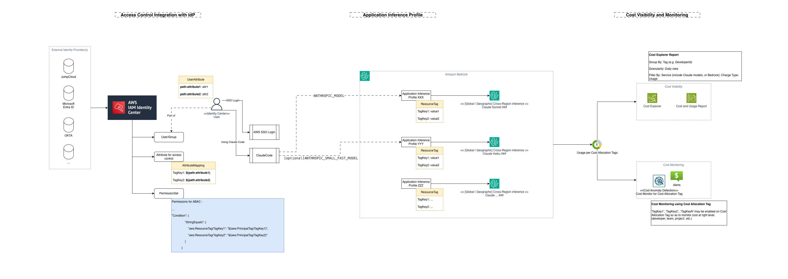
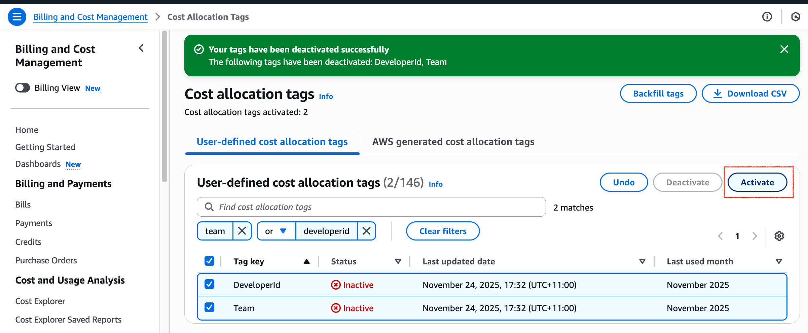
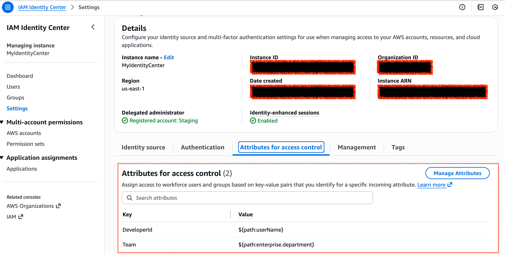
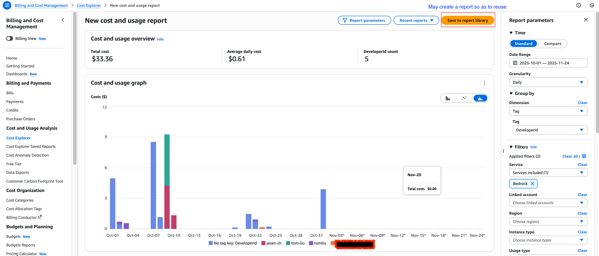
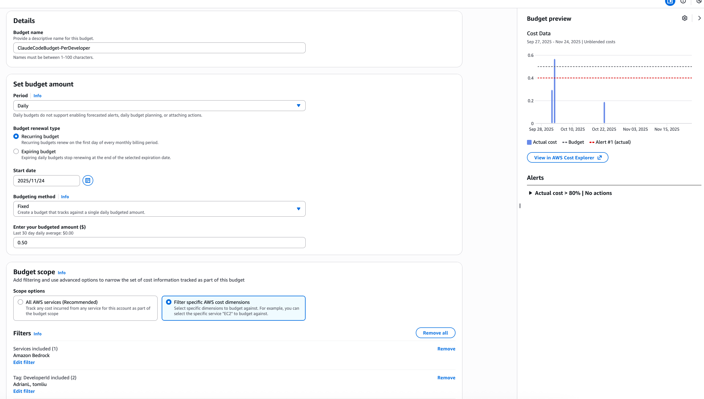

# Onboarding Guide - Claude Code on AWS 

## TL;DR;

The onboarding guide is to address onboarding challenges, including access control integration with identity provider (+ AWS Identity Center), cost tracking per developer level and cost monitoring.


>Claude Code usage metrics monitoring is not included at the stage.


## Solution Design

### Principals

* Using cost allocation tagging and Application Inference Profile(s) (aka AIPs, by Amazon Bedrock) to provide per-developer granularity usage tracking
* Using Attribute-based Access Control (ABAC) on AIP resources, with integration on AWS Identity Center. 
    * Least-privilege access on IAM. 
* Using Cost Explorer to view daily usage, and AWS Budgets (, or Cost Anomaly Detection) to monitor daily usage.


### Solution Architecture

#### Prerequisites

* To define the goals for cost visibility and monitoring.
    * To track per-developer granularity usage, or including project/team/department granularities?
    * Who owns cost monitoring, and the guidance on cost alerts?
* To define the resources tag being used on cost and usage tracking.
    * e.g. ‘Team’ and ‘DeveloperId’
* To define what AWS regions should be whitelisted for Claude Code usage
* To decide whether use Haiku FM on ‘small & fast’ model setting.
* To enable Bedrock model invocation logging.

#### Solution Architecture Design



### Implementation guidance

#### Application Inference Profile Setting

>Application inference profiles are user-defined resources. A user creates it to track costs and model usage. 


For Claude Code usage, we are aiming at creating related AIPs per developer. AIPs are user-defined resources, which supports resource tags, and using Cost Allocation Tags to track cost and usage.


>This guidance doesn’t provide developer registration management on Claude Code usage, but focus on providing little utilities to facilitate Claude Code onboarding.


The toolkit [claude-code-on-aws-onboarding-guide](https://github.com/tom5610/claude-code-on-aws-onboarding-guide) provides CLI commands to manage AIPs per specific resource tags. 


```
# Create AIP with tags
claude-code-og admin --tags '{"Team": "DevTeam", "DeveloperId": "dev123"}'

```


Once an AIP is created, in next 24hrs, the related tags will be available on Cost Allocation Tags console (Billing and Cost Management - Cost Allocation Tags). 



* Search the related resource tags
* Select them
* and Activate them.

In next 1-3 days, the tags will be available on Cost Explorer. Also, you may ‘Backfill tags’ from specific months so that you can have related user-defined tags associated with resource usage.


#### Access control integration with  Identity Provider

>In the implementation, we simply use AWS Identity Center with ‘identity center directory’ as the identity store. When using external IdP (e.g. JumpCloud, Extra ID, etc.), you may need to figure out related attribute path when creating identity attribute and resource tag mapping.


We configure ABAC in AWS using AWS Identity Center ([refer to checklist)](https://docs.aws.amazon.com/singlesignon/latest/userguide/abac-checklist.html). The purpose is to ease the pain on access control on Claude FMs. e.g. when only allow developers to use application inference profile by ABAC, developer only use the resources with the related tags matches with the related identity attributes.

**Reference configuration steps**


>The guidance steps are based on the [checklist](https://docs.aws.amazon.com/singlesignon/latest/userguide/abac-checklist.html).


1. Enable **Attributes for access control**



1. Create PermissionSet for Claude FMs access with ABAC settings

```
{
    "Version": "2012-10-17",
    "Statement": [
        {
            "Sid": "AllowFMsAccessViaAIPs",
            "Effect": "Allow",
            "Action": [
                "bedrock:InvokeModel",
                "bedrock:InvokeModelWithResponseStream"
            ],
            "Resource": [
                "arn:aws:bedrock:*:*:inference-profile/*",
                "arn:aws:bedrock:*:*:foundation-model/*"
            ]
        },
        {
            "Sid": "ABAC4AppInferenceProfiles",
            "Effect": "Allow",
            "Action": [
                "bedrock:InvokeModel",
                "bedrock:InvokeModelWithResponseStream",
                "bedrock:ListInferenceProfiles"
            ],
            "Resource": [
                "arn:aws:bedrock:*:*:application-inference-profile/*"
            ],
            "Condition": {
                "StringEquals": {
                    "aws:ResourceTag/Team": "${aws:PrincipalTag/Team}",
                    "aws:ResourceTag/DeveloperId": "${aws:PrincipalTag/DeveloperId}"
                }
            }
        },
        {
            "Sid": "AllowMarketplaceSubscription",
            "Effect": "Allow",
            "Action": [
                "aws-marketplace:ViewSubscriptions",
                "aws-marketplace:Subscribe"
            ],
            "Resource": "*",
            "Condition": {
                "StringEquals": {
                    "aws:CalledViaLast": "bedrock.amazonaws.com"
                }
            }
        }
    ]
}
```

* Section “AllowFMsAccessViaAIPs” is to block direct invocations on FMs or Cross-region Inference Profiles
  * Optionally, customer may add additional condition checking to ensure FMs or cross-region inference profile access is from application inference profile. However, this checking may slow the model invocations. 

```
			"Condition": {
				"Null": {
					"bedrock:InferenceProfileArn": "false"
				}
			}
```

* Section “ABAC4AppInferenceProfiles” is to enable ABAC on Application Inference Profiles access. (mapping with resource tags on principal tags, which were set up in previous section.)
* Section “AllowMarketplaceSubscription” is to enable direct Claude FMs access. (no more model access application via AWS Console..)


1. While setting PermissionSet, please assign target AWS Account(s) when using Claude FMs
2. Create Group and associated the PermissionSet to group(s)
3. Assign User to groups


#### Cost Visibility and Cost Monitoring

Once Cost Allocation Tags are enabled, with AWS Cost Explorer, customer can easily view daily Claude FMs usage per developer granularity. 

To do so, please open AWS Cost Explorer (Billing and Cost Management - Cost Explorer) on console, and select related searching criteria:

* Date Range: (“Month to Date” or last 1 month, etc.)
* Granularity: Daily 
* Group by: 
    * Dimension: Tag 
    * Tag: DeveloperId
* Filters:
    * Service: Bedrock (or, choosing related Claude FMs)
    * Charge type: Usage (cost with public pricing. For ‘Enterprise Customer’, you may select “Enterprise Discount” as well to view the discounted cost.)

e.g. 



Given Claude Code spend is backed by token consumption and cached tokens usage, it’s important to monitor usage so as to prevent extreme and unexpected usage. To do so, we highly recommend to use [AWS Budgets](https://docs.aws.amazon.com/cost-management/latest/userguide/budgets-managing-costs.html) or [Cost Anomaly Detection](https://docs.aws.amazon.com/cost-management/latest/userguide/manage-ad.html) to monitor cost allocation tag level. 


>Customer may use both to setup Daily cost monitoring, but [AWS Budgets](https://docs.aws.amazon.com/cost-management/latest/userguide/budgets-managing-costs.html) is more preferred as it allows adding ‘Service’ filter and support SNS topics in the alert configuration. 


The below is an example for AWS Budgets daily cost monitoring. ([Creating a budget](https://docs.aws.amazon.com/cost-management/latest/userguide/budgets-create.html))



